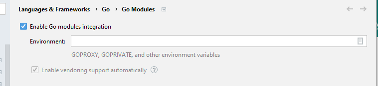

# goseachek

## Purpose

GoLang project only for educational purposes.

This is just a simple 'rest' server appending data on the search service and retrieving data from there.

## Commands 

Get Fiber: 

`go get -u github.com/gofiber/fiber/v2`

Enable Go modules integration:

